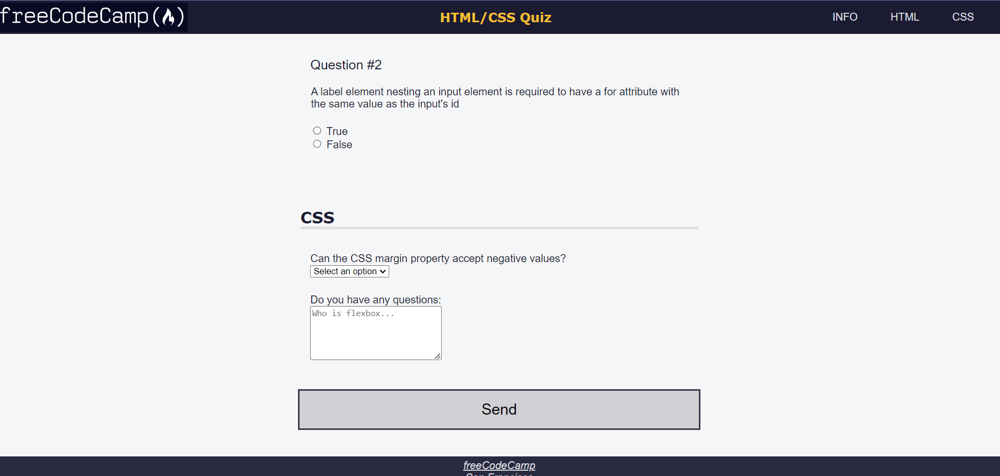

# Learn-accesibility

This is quiz project by building this it will teach you about accesibility on different devices.

# Accessibility Quiz



## Table of Contents

- [Description](#description)
- [Features](#features)
- [Installation](#installation)
- [Usage](#usage)
- [Technologies Used](#technologies-used)
- [Credits](#credits)
- [Contributing](#contributing)
- [License](#license)

---

## Description

This project is a practice quiz for HTML/CSS accessibility concepts, developed as part of the freeCodeCamp curriculum. It includes sections for entering student information and answering HTML and CSS-related questions.

---

## Features

- Student information form with fields for name, email, and date of birth.
- Sections for HTML and CSS questions with interactive components.
- Smooth scrolling behavior for enhanced user experience.
- Responsive design for different screen sizes.

---

## Installation

1. **Clone the repository:**

   ```bash
   git clone https://github.com/Manglam11/Learn-accesibility.git
   ```

2. **Live preview:**
   [Here](https://manglam11.github.io/Learn-accesibility/)

## Usage

1. **Fill out the student information form.**
2. **Answer the HTML and CSS questions based on your knowledge.**
3. **Navigate between sections using the navigation links in the header.**

## Technologies Used

- HTML
- CSS

---

## Credits

- This project was created as part of the freeCodeCamp curriculum.
- Images and icons provided by freeCodeCamp.

---

## Contributing

Contributions are welcome! Please fork the repository and submit a pull request with your changes.

---

## License

This project is licensed under the [MIT License](LICENSE).
